<div align="center">

# StoryProof

### Don't just tell the story. Verify it.

**Evidence-first KPI intelligence that verifies the story behind business metric movement before recommending action.**

[](https://www.python.org/)
[](https://streamlit.io/)
[](https://pytest.org/)
[](#project-status)
[](#challenge-context)

</div>

---

## What is StoryProof?

Traditional Business Intelligence is excellent at answering:

> **What changed?**

StoryProof adds the harder question:

> **What might explain the change, what evidence supports those explanations, and are we ready to act?**

StoryProof is an **evidence-first KPI intelligence-to-action engine**. It combines deterministic KPI analysis, driver attribution, competing hypotheses, structured and unstructured evidence, cross-KPI tension detection, decision readiness, and evidence-gated recommendations.

The central principle is simple:

> **A KPI movement is not automatically an explanation, and an explanation is not automatically a decision.**

---

# The problem in one example

Imagine an automated customer-support rollout.

The headline KPI looks excellent:

### **AHT ↓ 43.2%**

But at the same time:

| KPI | Baseline → Comparison | Movement |
|---|---:|---:|
| **Average Handling Time** | 10.16 → **5.77 min** | **↓ 43.2%** |
| **First Contact Resolution** | 68.4% → **67.5%** | ↓ 0.86 pp |
| **Customer Satisfaction** | 78.0 → **68.9 pts** | **↓ 9.1 pts** |
| **Repeat Contact Rate** | 16.4% → **30.4%** | **↑ 14.0 pp** |
| **Retention Rate** | 95.59% → **94.49%** | ↓ 1.10 pp |
| **AI Resolution Rate** | — | Insufficient history |

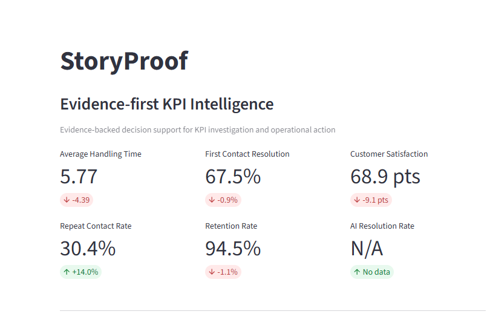

### The question StoryProof asks

> **If handling time improved by more than 40%, did customer support actually improve?**

A conventional dashboard can celebrate the efficiency gain.

StoryProof surfaces the conflicting customer signals and asks for verification **before treating the explanation as a reason to act**.

---

# Why StoryProof is different

| Traditional BI | StoryProof |
|---|---|
| Shows KPI movement | Detects material movement |
| Displays trends | Investigates measurable drivers |
| Surfaces correlations | Challenges competing explanations |
| Reports metrics | Connects structured + unstructured evidence |
| Presents narratives | Separates facts from hypotheses |
| Often treats results as actionable | Measures decision readiness |
| Recommends from analysis | Gates recommendations on evidence |
| Can hide uncertainty | Explicitly abstains when evidence is insufficient |
| Provides dashboard history | Maintains execution and governance history |

### The difference in one sentence

> **Traditional BI helps explain what happened. StoryProof verifies whether the explanation is sufficiently supported to act on.**

---

# See the product

## 01 — The conventional BI view

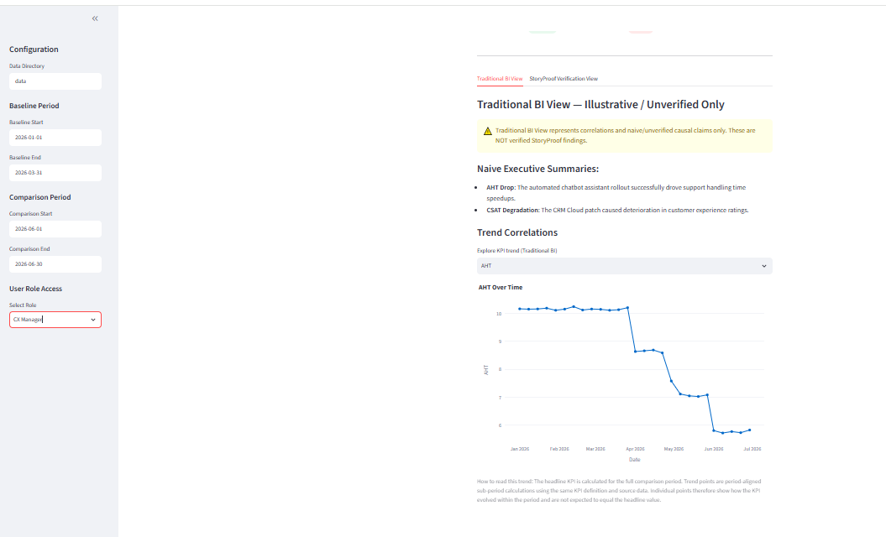

**What it shows:** KPI movement, trends and plausible narrative interpretation.

**What is still missing:** verification of whether the explanation is strong enough to support a decision.

---

## 02 — StoryProof verification

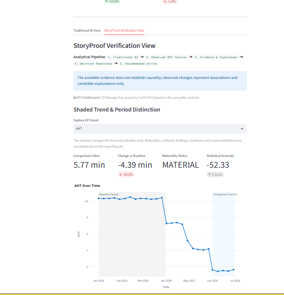

The verification layer brings together:

- Materiality and baseline signals
- Driver analysis
- Cross-KPI tension
- Evidence and competing hypotheses
- Decision readiness
- Evidence-gated recommendations

**The important distinction:** StoryProof does not convert correlation into proven causation.

---

## 03 — Different roles, different decisions

### CX Manager

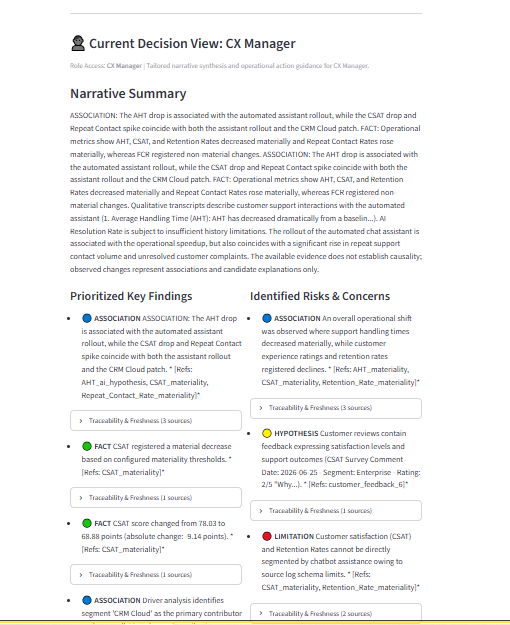

Focuses on customer-facing outcomes and experience signals.

### Operations Manager

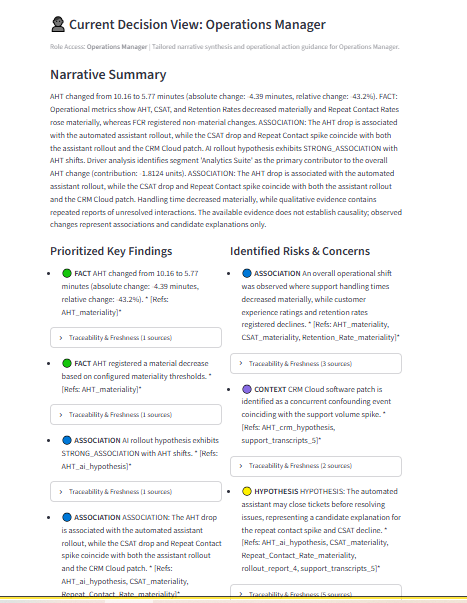

Focuses on operational performance, drivers, process risks and system evidence.

> **The analytical foundation remains consistent while the decision perspective changes by role.**

---

## 04 — Readiness before action

### CX Manager — 30 / 100

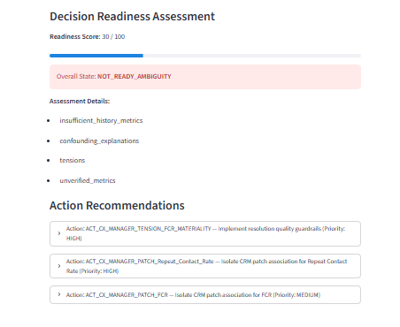

`NOT_READY_AMBIGUITY`

### Operations Manager — 20 / 100

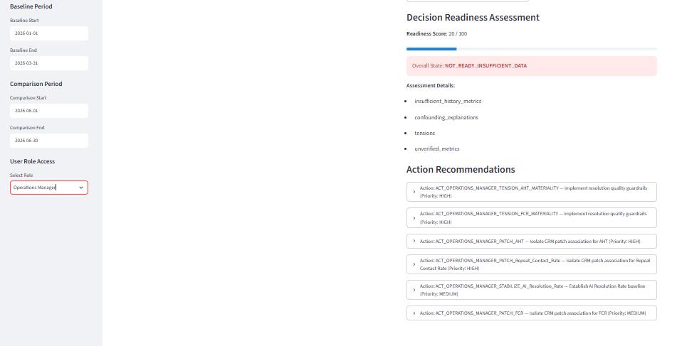

`NOT_READY_INSUFFICIENT_DATA`

StoryProof considers factors such as:

- Evidence sufficiency
- Historical depth
- Active confounders
- Cross-KPI tension
- Unverified material changes

> **Abstention is a valid analytical outcome.**

---

## 05 — Evidence-backed narrative


StoryProof distinguishes:

**FACT** — directly measured observation
**ASSOCIATION** — observed relationship without a causal claim
**HYPOTHESIS** — candidate explanation under evaluation
**CONTEXT / CONFOUNDER** — alternative factor that may influence the result
**LIMITATION** — data or evidence constraint

The system therefore keeps a plausible explanation visibly different from an established fact.

> **The available evidence does not establish causality; observed changes represent associations and candidate explanations only.**

---

## 06 — Role-based access

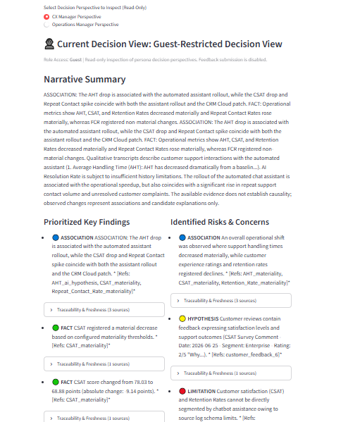

The prototype simulates role-based KPI entitlements.

**Guest**
- Read-only inspection
- Restricted decision perspective
- Administrative functions disabled

**Administrator**
- Full KPI access
- Audit and execution history
- Feedback records
- Runtime observability

---

## 07 — Governance and auditability

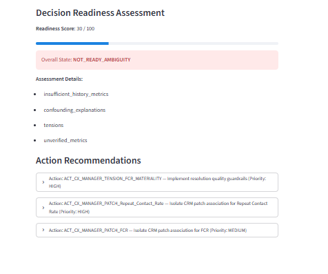

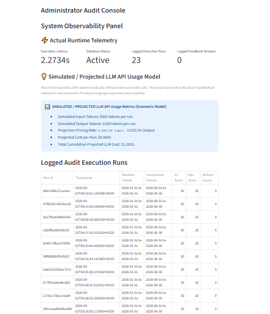

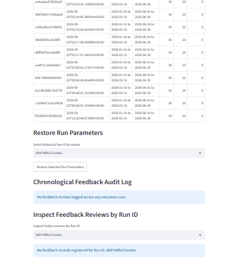

The prototype includes:

- Analyst feedback
- `APPROVED / REJECTED / FLAGGED`
- Execution history
- Run identifiers
- Runtime telemetry
- Audit context
- Governance treatment

> **Governance feedback does not modify the underlying KPI truth.**

---

# How StoryProof works

```text
┌──────────────────────────┐
│ 1. OBSERVE               │
│ Detect material movement │
└────────────┬─────────────┘
             ↓
┌──────────────────────────┐
│ 2. EXPLAIN               │
│ Analyze measurable       │
│ driver contribution      │
└────────────┬─────────────┘
             ↓
┌──────────────────────────┐
│ 3. CHALLENGE             │
│ Test competing           │
│ explanations             │
└────────────┬─────────────┘
             ↓
┌──────────────────────────┐
│ 4. VERIFY                │
│ Reconcile KPI + evidence │
│ + cross-KPI tension      │
└────────────┬─────────────┘
             ↓
┌──────────────────────────┐
│ 5. DECIDE                │
│ Assess readiness and     │
│ gate operational action  │
└──────────────────────────┘
```

### Stage 1 — Observe

Detect KPI movements and determine whether they are materially different from baseline behaviour.

### Stage 2 — Explain

Use deterministic calculations and driver decomposition to investigate measurable contribution patterns.

### Stage 3 — Challenge

Evaluate competing explanations rather than automatically assigning credit to the first plausible correlation.

Current hypothesis categories include:

- Automated-assistant rollout
- CRM system patch
- Volume / customer-mix shift

### Stage 4 — Verify

Combine structured KPI data with unstructured evidence such as:

- Support transcripts
- Customer feedback
- Operational / rollout reports

Evidence records retain provenance so surfaced statements can be traced to their sources.

### Stage 5 — Decide

Evaluate evidence sufficiency, historical depth, confounders and KPI tensions before allowing an operational recommendation.

Possible outcomes include:

```text
DECISION-READY
INVESTIGATION REQUIRED
NOT JUSTIFIED
```

---

# Cross-KPI tension: the StoryProof moment

The core demonstration is not one KPI in isolation.

It is the relationship between several signals:

```text
AHT
↓ significantly

while

CSAT
↓ significantly

Repeat Contact Rate
↑ significantly

Retention
↓
```

A conventional efficiency dashboard may emphasize the AHT improvement.

StoryProof asks whether that improvement is accompanied by evidence of degraded resolution quality or customer experience.

> **The story is not “AHT improved.”**
>
> **The story is “AHT improved while several customer outcomes deteriorated — investigate before acting.”**

---

# What happens when data is insufficient?

StoryProof can explicitly abstain.

In the demonstrated scenario, **AI Resolution Rate has only 21 unique calendar days of history**, while the configured requirement is **60 days**.

Therefore:

```text
AI Resolution Rate
        ↓
INSUFFICIENT HISTORY
        ↓
No false confidence
```

This is intentional.

> **A responsible decision system must know when it does not know enough.**

---

# Deterministic analytical core

The current prototype deliberately keeps quantitative truth deterministic and does **not** require a live external LLM API.

### KPI calculations

Aggregation, ratio calculations, unit normalization and comparison metrics are calculated directly from source data.

### Materiality

Threshold crossings and standardized baseline signals are calculated mathematically.

### Driver attribution

Mix-rate variance analysis and Shapley-style contribution decomposition are used to investigate observed KPI movement.

### Hypothesis evaluation

Competing explanations are evaluated using deterministic criteria such as:

- Pre/post concentration differences
- Volume-weighted comparisons
- Rollout-phase trends
- Concurrent system events

### Evidence retrieval

Unstructured evidence is retrieved through deterministic keyword, metadata and matching logic.

### Narrative synthesis

Quantitative findings, evidence, hypotheses and KPI tensions are combined through controlled templates.

### Action gating

Recommendations are generated through explicit evidence-gated rules.

**Design intent:** keep quantitative truth inspectable instead of allowing a generative model to become the source of KPI truth.

---

# Causality policy

StoryProof deliberately separates observed facts from explanations.

```text
FACT
  ↓
ASSOCIATION
  ↓
HYPOTHESIS
  ↓
CONTEXT / CONFOUNDER
  ↓
LIMITATION
```

Correlation and temporal overlap alone do not establish causality.

The prototype therefore uses:

> **The available evidence does not establish causality; observed changes represent associations and candidate explanations only.**

This policy is part of the analytical design, not just a disclaimer added to the interface.

---

# Decision readiness

StoryProof does not assume that every analytical result is immediately actionable.

Readiness considers:

- Data sufficiency
- Historical depth
- Active confounders
- Evidence quality
- Cross-KPI tension
- Unverified material changes

Representative readiness states include:

```text
insufficient_history
high_ambiguity
metric_tension_detected
unverified_material_change
```

The objective is to make **“not ready”** a legitimate result rather than forcing every investigation toward a recommendation.

---

# Evidence layer

StoryProof combines structured KPI data with unstructured operational evidence.

Current evidence sources include:

- Support transcripts
- Customer feedback comments
- Program / operational reports

Each evidence record retains provenance information so a surfaced statement can be traced back to its source.

The retrieval layer currently uses deterministic matching rather than a live generative retrieval system.

> **The explanation should remain traceable to evidence.**

---

# Action recommendations

Recommendations are evidence-gated and tied to operational context.

Representative action types include:

### `STABILIZE_BASELINE`

Used when insufficient historical baseline data exists.

### `SYSTEM_PATCH`

Used when a concurrent system release may be contributing to a KPI movement, subject to supporting hypothesis evidence.

### `RESOLUTION_GUARDRAIL`

Used when efficiency improvements conflict with customer-quality signals such as complaints or repeat contacts.

Potential controls include:

- Auto-closure guardrails
- Routing controls
- Resolution-quality monitoring

### `OPERATIONAL_OPTIMIZATION`

Used only when the relevant improvement is sufficiently verified and active risk flags do not block the recommendation.

---

# Governance

StoryProof includes a human-in-the-loop review mechanism backed by SQLite.

Analyst reviews can be:

```text
APPROVED
REJECTED
FLAGGED
```

Historical reviews can influence governance treatment for matching recommendations.

They do **not** change:

- KPI calculations
- Materiality
- Evidence truth
- Driver decomposition
- Analytical confidence

This keeps governance separate from analytical truth.

---

# Architecture

```text
                         ┌──────────────────────┐
                         │      Source Data     │
                         │ KPI + Evidence Data  │
                         └──────────┬───────────┘
                                    ↓
                         ┌──────────────────────┐
                         │  KPI Semantic Layer  │
                         │ units / thresholds   │
                         │ lineage / access     │
                         └──────────┬───────────┘
                                    ↓
                         ┌──────────────────────┐
                         │ Materiality Analysis │
                         │ baseline / volatility│
                         └──────────┬───────────┘
                                    ↓
                         ┌──────────────────────┐
                         │ Driver Decomposition │
                         └──────────┬───────────┘
                                    ↓
                         ┌──────────────────────┐
                         │ Hypotheses +         │
                         │ Confounders           │
                         └──────────┬───────────┘
                                    ↓
                         ┌──────────────────────┐
                         │ Evidence Retrieval + │
                         │ Tension Detection    │
                         └──────────┬───────────┘
                                    ↓
                         ┌──────────────────────┐
                         │ Narrative Synthesis  │
                         │ + Causality Policy   │
                         └──────────┬───────────┘
                                    ↓
                         ┌──────────────────────┐
                         │ Decision Readiness   │
                         └──────────┬───────────┘
                                    ↓
                         ┌──────────────────────┐
                         │ Evidence-Gated       │
                         │ Recommendations      │
                         └──────────┬───────────┘
                                    ↓
                         ┌──────────────────────┐
                         │ Governance + Audit   │
                         └──────────────────────┘
```

---

# Technology stack

| Layer | Technology |
|---|---|
| Language | Python |
| Dashboard | Streamlit |
| Data processing | Pandas, NumPy |
| Visualization | Plotly |
| Configuration | YAML |
| Runtime audit store | SQLite |
| Testing | Pytest |

---

# Repository structure

```text
StoryProof/
│
├── app.py
├── requirements.txt
├── README.md
│
├── config/
│   ├── kpi_definitions.yaml
│   ├── evidence_sources.yaml
│   └── simulation_config.yaml
│
├── data/
│   ├── support_daily.csv
│   ├── cx_weekly.csv
│   ├── crm_monthly.csv
│   ├── ai_resolution_rate.csv
│   └── unstructured/
│
├── scripts/
│   ├── generate_data.py
│   └── validate_data.py
│
├── src/
│   ├── engine/
│   │   ├── actions.py
│   │   ├── drivers.py
│   │   ├── evidence.py
│   │   ├── hypotheses.py
│   │   ├── materiality.py
│   │   ├── personas.py
│   │   ├── readiness.py
│   │   ├── retrieval.py
│   │   └── synthesis.py
│   │
│   └── feedback/
│       └── handler.py
│
├── tests/
│
└── docs/
    └── screenshots/
```

---

# Run locally

## 1. Create a virtual environment

```bash
python -m venv .venv
```

## 2. Activate it

### Windows PowerShell

```powershell
.venv\Scripts\Activate.ps1
```

### Linux / macOS

```bash
source .venv/bin/activate
```

## 3. Install dependencies

```bash
pip install -r requirements.txt
```

## 4. Start StoryProof

```bash
streamlit run app.py
```

The interactive dashboard will open in your browser.

---

# Validate the data

### Windows PowerShell

```powershell
$env:PYTHONPATH="."
.venv\Scripts\python.exe scripts/validate_data.py
```

### Linux / macOS

```bash
export PYTHONPATH=.
python scripts/validate_data.py
```

The validation workflow checks dataset structure, KPI semantic contracts, expected business patterns, evidence consistency, historical sufficiency and materiality inputs.

---

# Testing

Run:

```bash
python -m pytest tests/ -q
```

### Current validation

**241 tests passing**

The suite covers analytical logic, KPI provenance, evidence, retrieval, hypotheses, recommendations, readiness, personas, feedback, dashboard integration and layout.

---

# Validation snapshot

The demonstrated scenario contains:

- `support_daily.csv` — 27,539 rows
- `cx_weekly.csv` — 972 rows
- `crm_monthly.csv` — 72 rows
- `ai_resolution_rate.csv` — 252 rows
- AI Resolution Rate — 21 unique calendar days

| KPI | Validation state |
|---|---|
| AHT | **Material change** |
| FCR | **Not material** |
| CSAT | **Material change** |
| Repeat Contact Rate | **Material change** |
| Retention Rate | **Material change** |
| AI Resolution Rate | **Insufficient history** |

---

# Design principles

### Evidence before explanation
A plausible story remains a hypothesis until evidence supports it.

### Determinism before generation
Quantitative truth comes from explicit calculations and rules.

### Abstention is valid
Insufficient evidence should prevent overconfident conclusions.

### Causality must be earned
Correlation and temporal overlap do not establish causality.

### Governance is separate from truth
Human feedback changes governance treatment, not underlying KPI facts.

### Recommendations require gates
Actions should be tied to an evidence state and accountable owner.

### Traceability matters
Analytical outputs should remain traceable to source data, evidence, rules and execution history.

---

# Business value

StoryProof is designed to help organizations:

**Reduce premature decisions**
Avoid turning plausible correlations into assumed causes.

**Surface hidden KPI tension**
Identify when operational efficiency improves while customer outcomes deteriorate.

**Prioritize investigation**
Focus analyst attention on material, ambiguous or insufficiently supported findings.

**Scale decision discipline**
Apply consistent verification logic across KPIs and decision personas.

> **StoryProof turns business intelligence from a reporting endpoint into an evidence-gated decision process.**

---

# For recruiters & hiring managers

StoryProof demonstrates practical work across:

- Business Intelligence and KPI analytics
- Data processing and semantic contracts
- Statistical / materiality analysis
- Driver attribution
- Structured + unstructured data integration
- Evidence retrieval and provenance
- Explainable analytical workflows
- Decision-readiness scoring
- Rule-based recommendation systems
- Role-based access and governance
- Auditability
- Automated testing and validation

### Resume-ready description

> **Built StoryProof, an evidence-first BI intelligence-to-action engine that evaluates KPI movements, competing explanations and structured/unstructured evidence to determine decision readiness before recommending operational actions.**

### Short resume version

> **Built an evidence-first BI system that verifies the story behind KPI movements before recommending action.**

---

# Limitations & future evolution

The current repository is a working prototype using validated synthetic business data.

Potential production evolution includes:

- Production data connectors
- SSO / IAM integration
- Enterprise metadata catalogs
- More advanced statistical testing
- Production-grade semantic retrieval
- Optional governed generative-language assistance
- Enterprise observability and monitoring

These are future production considerations, **not dependencies of the current prototype**.

---

# Project status

**Working prototype**

StoryProof demonstrates the workflow from:

**KPI observation → verification → decision readiness → recommendation → governance**

The central question remains:

> **What changed?**

followed by the more important question:

> **Is the story we are telling about that change actually supported by the available evidence?**

---

# Challenge context

**Accenture Innovation Challenge 2026**
**Track 3 — BusinessIntelligence.ai**

### StoryProof

> **Don't just tell the story. Verify it.**

---

<div align="center">

**Built by Kushagra Dixit · Team VERINAUT · Indian Institute of Technology Patna**

</div>
